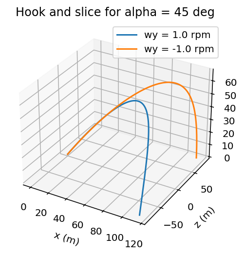
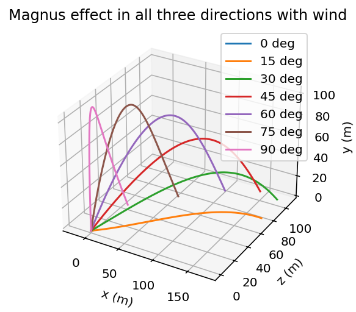

# Golf Trajectory – Numerical Simulation

## Overview

This project simulates the trajectory of a golf ball, including gravity, drag, Magnus force and wind effects using the explicit Euler method.

It explores how launch angle, spin, wind and air density influence the three-dimensional motion of the ball.

---

## Model & Method

- Three-dimensional golf ball trajectory  
- Explicit Euler method  
- Gravitational acceleration  
- Drag force with speed-dependent drag coefficient  
- Magnus force from ball spin  
- Wind contribution  
- Constant, adiabatic and isothermal air density models  

---

## Results

### Hook and slice trajectories



### Trajectories with wind effects



The results show how spin orientation and wind modify the ball trajectory, producing lateral deviations (hook and slice) as well as changes in range and height.

---

## How to run

Run the script:

```bash
python golf_trajectory_simulation.py
```

By default, the script runs:
- Case 2 → Hook and slice (wy), no wind

To explore other simulations, enable interactive mode:

```python
main(mode="interactive")
```

Available cases:

- Only z-component of spin, no wind
- Hook and slice (wy), no wind
- Three spin components, no wind
- Three spin components with wind
- Isothermal vs adiabatic density models
- Custom input mode

---

## Notes
- The vertical axis corresponds to the y coordinate, while z represents lateral deviation

